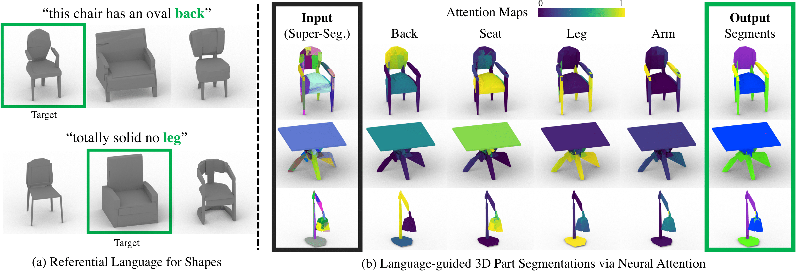
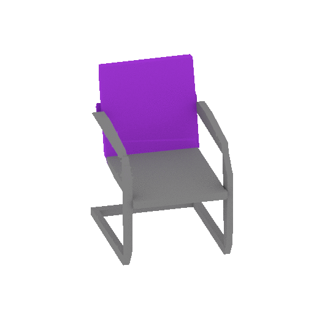
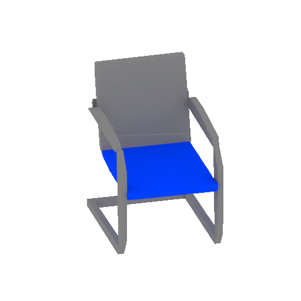
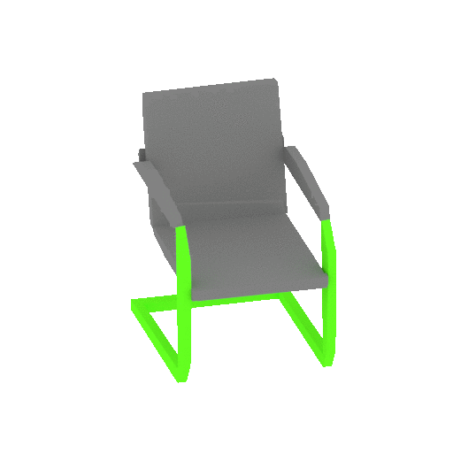
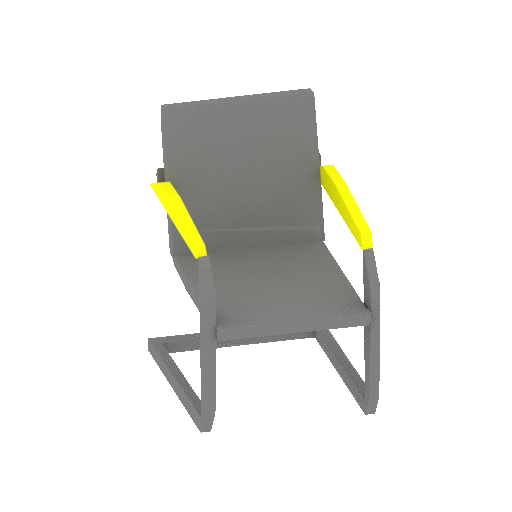

# PartGlot: Learning Shape Part Segmentation from Language Reference Games



| "rectangle _back_" | "thin _seat_" | "two _legs_" | "opening _arms_" |
| ---- | ---- | ---- | --- |
|  |  |  | 


## Introduction
This repo is a pytorch-lightning implementation of **CVPR2022 paper (Oral)** [PartGlot](https://arxiv.org/abs/2112.06390). 

PartGlot introduces a novel way _to segment 3D parts from solely part referential language._
We reflect the human perception mechanism that the human attends to specific regions on objects when given information about that region. To exploit this fact, we train a neural listener on reference games, where the model has to differentiate a target shape among two distractors based on utterances describing the target.
We investigate how well the model can connect part names in the utterances to specific regions in the geometry of the 3D shapes _by just solving classification tasks._  
We achieved __79.4% instance mIoU__ on ShapeNet Chair class __*without any direct geometric supervision and fine-grained annotations*__.
Furthermore, we deomonstrate that the part information learned from language can be generalizable to Out-of-Distribution shape classes as well.
For instance, Table _top_ is highly considered as Chair _seat_ with __78.2% mIoU__ and Lamp _base_ as Chair _leg_ with __44.6% mIoU__.


## Quantitative Results

IoU(%)s on ShapeNet Chair dataset:

| Method | Back | Seat | Leg  | Arm  | Average  |
| -----  | ---  | ---  | ---- | ---- | ---- |
| Part-Name-Agnostic | 82.2 | 78.8 | 75.5 | 40.6 | 69.3 |
| Part-Name-Aware | 84.9 | 83.6 | 78.9 | 70.4 | 79.4 |

## Get Started
### Dependencies
For main requirements, we have tested the code with Python 3.8.0, CUDA 11.1 and Pytorch 1.9.0.  
Clone the repo and install other libraries:
```
git clone https://github.com/63days/PartGlot
cd PartGlot
pip install -e .
```
### Data and pre-trained weights
We provide ready-to-use data and pre-trained weights [here](https://drive.google.com/drive/folders/1jvPclGP5Dg0653wrMvN8WX9am7txZJu8). Download data and put them in `data` directory. 

## Test 
To test pre-trained PartGlots, download checkpoints from the link above and pass a path of the checkpoint:
### Part-Name-Agnostic

```
python test.py model=pn_agnostic ckpt_path=checkpoints/pn_agnostic.ckpt save_dir=logs/pre_trained/pn_agnostic
```
### Part-Name-Aware
```
python test.py model=pn_aware ckpt_path=checkpoints/pn_aware.ckpt save_dir=logs/pre_trained/pn_aware
```
It will measure IoUs per part and instance mIoU, and save predicted labels per shape in `save_dir`.

## Train
You can train PartGlot in two ways: __Part-Name-Agnostic__ and __Part-Name-Aware__.

### Part-Name-Agnostic
```
python train.py model=pn_agnostic epochs=30 batch_size=64 trainer.gpus=[0]
```
To train a part-name-agnostic model, pass `model=pn_agnostic`.

You can train with multi GPUs by passing a list of devie numbers, for instance `trainer.gpus=[0,1,2]`.

### Part-Name-Aware
```
python train.py model=pn_aware model.xnt_reg=true model.xnt_reg_weights=1e-2
```
To train a model with part-name-aware setup, change `model=pn_aware`.

You can control hyper-parameters related to a cross-entropy regularization by changing `model.xnt_reg` and `model.xnt_reg_weights`.

## Citation
If you find our work useful, please consider citing our paper:
```
@inproceedings{koo2022partglot,
    title={PartGlot: Learning Shape Part Segmentation from Language Reference Games},
    author={
        Koo, Juil and
        Huang, Ian and
        Achlioptas, Panos and
        Guibas, Leonidas J and
        Sung, Minhyuk
    },
    booktitle={Proceedings of IEEE Conference on Computer Vision and Pattern Recognition (CVPR)},
    year={2022}
}
```
